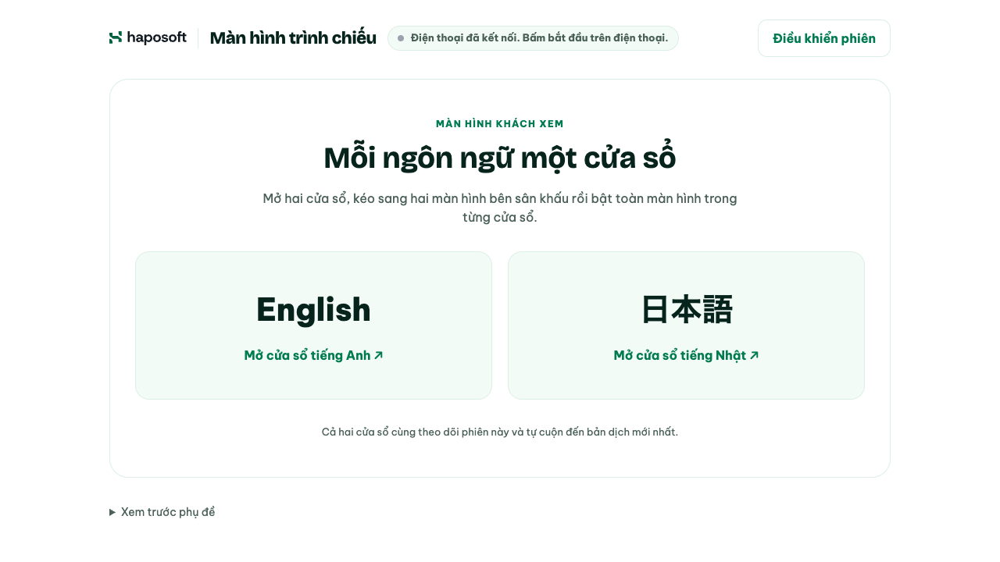

# Live Trans

Thu lời nói tiếng Việt từ điện thoại và hiển thị bản dịch tiếng Anh, tiếng Nhật
trên web theo thời gian thực. Dùng cho hội nghị, sự kiện và các buổi giao lưu để
khách nước ngoài theo dõi nội dung người dẫn chương trình đang nói.

Trang điều khiển và app dùng giao diện sáng. Cửa sổ phụ đề sân khấu dùng nền
xanh rêu theo màu sự kiện Haposoft 10 năm, chữ sáng căn trái, không logo/tiêu đề lớn để tập trung đọc nội dung.
Không cần GPU hay cài phần mềm trên máy tính trình chiếu.

- **Mở web:** [live.hapo.work](https://live.hapo.work/)
- **Hướng dẫn có hình:** [Hướng dẫn sử dụng](https://live.hapo.work/guide.html)
- **Tải app:** [GitHub Releases](https://github.com/hapo-nghialuu/live-trans/releases)



## Sử dụng

1. Trên máy tính kết nối máy chiếu, mở web và chọn **Tạo phiên mới**.
   Mã phiên gồm 6 số được tạo tự động; có thể chọn mã riêng trong phần tùy chọn.
2. Trên điện thoại, mở app Live Trans, **quét QR**, **nhập mã phiên** hoặc
   **dán liên kết micro**. Nếu không cài app, dùng Camera quét QR để mở trang micro.
3. Giữ trang phụ đề trên máy tính mở. Trên điện thoại chọn **Bắt đầu** và
   cho phép dùng micro. Nói tiếng Việt, ngắt nhẹ giữa các câu.
4. Khi chưa có điện thoại kết nối, web ưu tiên QR lớn và mã phiên để dễ quét.
   Khi điện thoại kết nối, web hiện hai nút mở cửa sổ **English** và **日本語**.
   Mở từng cửa sổ, kéo sang hai màn hình dọc rồi chọn **Toàn màn hình** trong
   từng cửa sổ (mở mục **Controls** / **操作** ở góc dưới). Mỗi cửa sổ chỉ hiển thị một ngôn ngữ và tự cuộn khi có bản dịch mới.
5. Chọn **Dừng** trên điện thoại để dừng thu và hoàn tất câu cuối.
   Trên web mở **Điều khiển phiên** để dừng thu từ xa, rời phiên hoặc kết thúc
   phiên cho mọi người (cần xác nhận).

Có thể cuộn lại để đọc câu cũ. Lời nhận dạng tạm thời không kéo vị trí cuộn;
bản dịch mới sẽ đưa cửa sổ về cuối. Nút **Điều khiển phiên** trên trang chính
mở các thao tác quản lý; nút toàn màn hình nằm riêng trong từng cửa sổ phụ đề. **Rời phiên** chỉ về trang chính
trên máy này; **Kết thúc phiên cho mọi người** ngắt micro và xóa lịch sử. Nếu điện
thoại ngắt kết nối, web hiện lại QR; lịch sử vẫn được giữ cho đến khi phiên kết thúc.

**Lấy tiếng từ bàn mixer:** ở hội trường có hệ thống âm thanh, nối cổng AUX/REC OUT
của mixer vào card âm thanh USB trên laptop rồi mở liên kết micro trên trình duyệt
của laptop. Mở mục **Nguồn âm thanh** dưới thanh âm lượng: chọn card USB, bật
**Nguồn từ mixer** để tắt lọc vọng, lọc ồn và tự chỉnh âm lượng, rồi bấm
**Kiểm tra tín hiệu** để xem mức âm mà chưa gửi gì lên máy chủ. Trang cảnh báo khi
tín hiệu quá mức hoặc quá nhỏ. Lựa chọn được nhớ trên trình duyệt đó.

Cũng có thể tạo phiên từ app điện thoại, sau đó nhập mã trên web để vào xem.
Cần có ít nhất một màn hình xem trước khi bắt đầu thu âm. Trang điều khiển và
hai cửa sổ phụ đề dùng chung phiên, không tạo thêm phiên dịch hay gọi AI riêng.
Nếu trình duyệt chặn cửa sổ bật lên, cho phép popup hoặc mở liên kết trong tab mới.
Mỗi cửa sổ tính là một màn hình xem trong giới hạn 5 màn hình/phòng.

### Cài app điện thoại

Mở [trang Releases](https://github.com/hapo-nghialuu/live-trans/releases), chọn
bản mới nhất và mở **Assets**:

| Thiết bị | Cách sử dụng |
|---|---|
| Android | Tải `LiveTransMic-vX.Y.Z.apk`, cài và cấp quyền micro; cấp quyền camera khi quét QR. APK hiện được build ở chế độ debug. |
| iPhone | File `LiveTransMic-vX.Y.Z-unsigned.ipa` chưa ký, cần ký trước khi cài lên thiết bị. Có thể dùng Safari qua QR nếu chưa cài app. |

Tại ngày 30/09/2026, bản mới nhất là
[v0.1.17](https://github.com/hapo-nghialuu/live-trans/releases/tag/v0.1.17), có cả
APK và IPA chưa ký. Các bản hiện được đánh dấu **Pre-release**, vì vậy dùng
trang Releases để chọn bản mới nhất.

### Chuẩn bị trước khi trình chiếu

- Máy tính và điện thoại cần mạng ổn định, không bắt buộc cùng Wi-Fi.
- Đặt điện thoại gần người nói hoặc nguồn âm thanh của MC; thử vài câu có tên
  riêng, số và giờ trước khi bắt đầu.
- Trang micro trên trình duyệt cần HTTPS, AudioWorklet và quyền micro.
  Giữ trang mở, không khóa màn hình hoặc chuyển ứng dụng khi đang thu bằng web.
- App iOS có cấu hình thu âm nền; khả năng thu khi khóa màn hình cần kiểm tra
  trên thiết bị thực tế. Build thành công chưa chứng minh thu âm nền hoạt động.
- Khi mất kết nối, kiểm tra trạng thái rồi bấm **Bắt đầu** lại nếu cần.
  AI vẫn có thể nhận dạng hoặc dịch sai, nhất là tên riêng và số liệu.

## Luồng xử lý

```text
Điện thoại / trang micro
  → PCM16 mono 16 kHz qua WebSocket
  → Backend nhận dạng tiếng Việt bằng Gemini hoặc Deepgram
  → Gemini dịch câu hoàn chỉnh sang tiếng Anh và tiếng Nhật
  → Web cập nhật phụ đề để trình chiếu
```

| Công đoạn | Mặc định | Thay thế / dự phòng |
|---|---|---|
| Nhận dạng giọng nói | `gemini-3.5-transcribe-live` | Deepgram `nova-3`, chọn ở Cài đặt |
| Dịch Anh và Nhật | `gemini-3.5-flash-lite`, thinking `MINIMAL` | `gemini-3.1-flash-lite` khi model chính lỗi |

Deepgram chỉ thay phần nhận dạng; bản dịch vẫn gọi Gemini và cần Google API key.
Khi dịch gặp HTTP 429, server tạm bỏ qua model đó theo thời gian chờ từ provider
(mặc định 10 phút nếu không có), rồi thử model dự phòng. Nếu cả hai không dùng
được, ứng dụng báo lỗi cho câu đó. Hạn mức thực tế phụ thuộc project/gói API,
không phải giới hạn cố định của app.

Gemini tự mở kết nối nhận dạng tiếp theo sau khoảng 8,5 phút và chuyển khi
kết nối mới sẵn sàng. Khi upstream đóng bất ngờ, server thử nối lại tối đa
3 lần liên tiếp. Phòng vẫn có giới hạn thời gian riêng.

## Chạy local

Yêu cầu **Node.js 24 trở lên**, npm và Google API key có quyền dùng các model
đang cấu hình. Backend chỉ lắng nghe ở `127.0.0.1`.

```sh
npm ci
GOOGLE_API_KEY_FILE=/duong-dan/gemini-key.txt npm start
```

Mở `http://localhost:4317/`. Có thể cấu hình bằng biến môi trường hoặc file
`.env` tại gốc dự án; `npm start` tự đọc file này nếu có. Không commit API key.

Micro trên localhost được trình duyệt cho phép, nhưng địa chỉ LAN HTTP thông
thường không đủ để điện thoại thu bằng web. Để thử bằng điện thoại, dùng URL
HTTPS được cấu hình đúng trên backend và reverse proxy.

### Cấu hình backend

| Biến | Ý nghĩa / mặc định |
|---|---|
| `GOOGLE_API_KEY` | Key Gemini trên backend, dùng nhận dạng và dịch. |
| `GOOGLE_API_KEY_FILE` | Đọc key từ file thay cho biến trực tiếp; file phải chứa đúng một key. |
| `DEEPGRAM_API_KEY` | Key nhận dạng Deepgram, tùy chọn. |
| `DEEPGRAM_API_KEY_FILE` | Đọc Deepgram key từ file thay cho biến trực tiếp. |
| `TRANSCRIBE_PROVIDER` | `gemini` hoặc `deepgram`; mặc định Gemini nếu có Google key, nếu không là Deepgram. |
| `DEEPGRAM_MODEL` | Mặc định `nova-3`. |
| `DEEPGRAM_URL` | Mặc định `wss://api.deepgram.com/v1/listen`. |
| `TRANSLATE_FALLBACK_MODEL` | Model dịch dự phòng; mặc định `gemini-3.1-flash-lite`. |
| `APP_ACCESS_KEY` | Tùy chọn, ít nhất 24 ký tự; bảo vệ tạo phiên và đổi provider. Bỏ trống cho phép hai thao tác này công khai. |
| `PUBLIC_URL` | URL công khai đầy đủ, gồm base path; mặc định `http://localhost:4317/`. |
| `PUBLIC_ALIASES` | Các URL HTTPS bổ sung ở gốc tên miền, phân cách bằng dấu phẩy. |
| `PORT` | Cổng backend; mặc định `4317`. |
| `SETTINGS_FILE` | File lưu provider chọn ở Cài đặt; thư mục chứa phải tồn tại và có quyền ghi. |
| `STATE_DIRECTORY` | Nếu không đặt `SETTINGS_FILE`, dùng `settings.json` trong thư mục trạng thái đầu tiên. systemd cấp biến này qua `StateDirectory`. |
| `NODE_ENV` | Đặt `production` khi triển khai. |

Model nhận dạng Gemini và model dịch chính được đặt trong
[server/config.js](server/config.js). Cài đặt trên web thay provider mặc định
cho **phiên mới**; phiên đang chạy giữ provider khi tạo. Provider đã lưu trong
file settings được ưu tiên khi khởi động nếu key tương ứng còn được cấu hình.
Nếu không đặt nơi lưu settings, lựa chọn chỉ tồn tại đến khi server khởi động lại.

## Phát triển và phát hành app

App trong `mobile/` dùng React Native 0.87.1, chung giao thức với micro web.
Giao diện ưu tiên quét QR/nhập mã; tạo phiên và liên kết nằm trong mục mở rộng.
Cài đặt nằm ở nút bánh răng. Trong phiên, nút micro lớn dùng bắt đầu/dừng,
phụ đề mở riêng qua **Xem phụ đề**; nút rời phiên xác nhận nếu đang thu.
Client vào phòng, đợi `snapshot`, gửi `start` và chỉ truyền audio khi server trả
`ready`. App nhớ địa chỉ server và mã truy cập tạo phiên bằng AsyncStorage.

```sh
cd mobile
npm ci
npm start
```

Mở terminal khác trong `mobile/`:

```sh
# iOS: macOS có Xcode và CocoaPods
cd ios
pod install
cd ..
npm run ios

# Android: JDK 17 và Android SDK theo mobile/android/build.gradle
npm run android
```

Workflow [mobile-builds.yml](.github/workflows/mobile-builds.yml) dùng Node.js 24:

- Tự chạy khi push thay đổi `mobile/**` hoặc chính workflow lên nhánh **`build`**.
- Có thể chạy thủ công bằng **Run workflow** trong GitHub Actions.
- Tăng phiên bản patch, build APK debug và IPA Release chưa ký; khi cả hai thành
  công, xuất bản GitHub Pre-release kèm hai file tải.

Push lên `main` không tự kích hoạt workflow này. Workflow mobile không deploy
web/backend. Logo và giao diện đóng gói trong app cần cài bản app mới để cập nhật.

## Triển khai web/backend

Kiểm tra ngày 30/09/2026: `live-trans.service` đang chạy, hai URL dưới đây trả
`{"ok":true}` ở `/api/health`; web đang phục vụ từ release `b52371f` đã có
trang hướng dẫn bằng hình và favicon bo góc.

| Thành phần | Cấu hình triển khai |
|---|---|
| URL chính | `https://live.hapo.work/` |
| URL tương thích | `https://assistant.hapo.work/live-trans/` |
| Reverse proxy | Caddy → `127.0.0.1:4317`, mẫu [caddy-snippet.txt](deploy/caddy-snippet.txt). |
| Thư mục release | `/home/ubuntu/live-trans/releases/`; symlink `current` trỏ bản đang chạy. |
| Service | `live-trans.service`, mẫu [live-trans.service](deploy/live-trans.service). |
| Runtime config | `/etc/live-trans/runtime.env`, root sở hữu, quyền `600`. |
| SSH alias quản trị | `hapo_gateway_stg` |

Cập nhật bằng một lệnh, sau khi đã commit và push lên `main`:

```sh
scripts/deploy.sh          # hỏi xác nhận trước khi restart
scripts/deploy.sh --yes    # bỏ qua câu hỏi
```

Script lấy đúng nội dung commit `HEAD` (`git archive`) vào `releases/<sha 7 ký tự>`,
chạy `npm ci --omit=dev`, `npm run check` và `npm test` ngay trên server, chuyển
symlink `current`, restart và chờ `/api/health`. Nếu service không khoẻ, script tự
trỏ `current` về release trước. Cuối cùng kiểm tra URL công khai, giữ 5 release mới
nhất (`DEPLOY_KEEP`) và in lệnh rollback. Script từ chối chạy khi còn thay đổi chưa
commit hoặc `HEAD` chưa được push. Khi đổi tên
miền/đường dẫn, cập nhật `PUBLIC_URL`/`PUBLIC_ALIASES` và route Caddy; validate
cấu hình Caddy trước khi reload. QR dùng origin đang mở khi origin đó được
khai báo trong aliases.

```sh
ssh hapo_gateway_stg 'systemctl is-active live-trans'
curl -fsS https://live.hapo.work/api/health
curl -fsS https://live.hapo.work/api/config
```

`/api/health` xác nhận HTTP backend hoạt động. `/api/config` chỉ báo key nào đã
được cấu hình và provider mặc định, không kiểm chứng key còn quota hoặc gọi AI
thành công. Rollback bằng cách chuyển `current` về release trước rồi restart.
**Restart server kết thúc toàn bộ phiên đang giữ trong RAM.**

## Giới hạn và dữ liệu

- Tối đa **3 phòng**; mỗi phòng **1 micro**, **5 màn hình xem**, thời hạn **2 giờ**.
- Giữ tối đa **30 câu** mỗi phòng trong RAM. Không còn micro/kết nối nhận dạng
  và đã quá 15 phút từ lúc tạo thì phòng được dọn ở lượt kiểm tra tiếp theo.
- Mất toàn bộ màn hình xem trong **10 giây** sẽ dừng thu âm.
- Hàng đợi dịch tối đa **6 câu chờ** và một câu đang xử lý; quá tải sẽ báo lỗi.
- Tạo phiên: tối đa **30 lần/giờ/IP**, **20 lần/phút toàn server**.
  Tra mã phiên: **30 lần/phút/IP**.
- Audio gửi tới provider nhận dạng đã chọn; lời Việt và ngữ cảnh gần đây gửi
  Google để dịch. Ứng dụng không ghi audio, transcript hoặc token vào file/DB/log;
  chính sách lưu dữ liệu của provider là phần riêng của dịch vụ đó.
- Kết thúc, hết hạn hoặc restart sẽ xóa phòng và lịch sử. Luồng hiện tại không
  có chức năng lưu bản ghi hay xuất transcript.
- API key chỉ nằm trên backend. Web không lưu mã truy cập/token phòng trong
  localStorage; app có lưu mã truy cập tạo phiên như mô tả ở trên.
- Mã phiên và QR cho phép tham gia phòng; QR micro chứa quyền thu âm.
  Chỉ chia sẻ với người tham gia buổi sử dụng.

## Kiểm tra

```sh
# Backend và JavaScript web
npm run check
npm test

# App điện thoại
cd mobile
npx tsc --noEmit
npm run lint
npm test -- --runInBand
```

Để kiểm tra luồng AI thực, chạy từ gốc dự án khi backend đã hoạt động:

```sh
npm run test:live
```

Lệnh này tiêu thụ quota API: dùng giọng Linh trên macOS tạo âm thanh tiếng Việt,
gửi PCM theo thời gian thực qua WebSocket và kiểm tra bản dịch trên client xem
thứ hai. Linux hoặc máy không có giọng Linh có thể truyền `PCM_FILE` là file
PCM16 mono 16 kHz thô. Đổi đích bằng `LIVE_TRANS_URL`; truyền mã tạo phiên qua
`LIVE_TRANS_ACCESS_KEY` nếu server yêu cầu. File tạm được xóa sau kiểm tra.

Unit test và giọng tổng hợp không thay thế kiểm tra micro/camera trên điện thoại,
thu âm nền, máy chiếu hoặc vận hành liên tục trong buổi thực tế.

## Cấu trúc dự án

| Thư mục | Nội dung |
|---|---|
| `public/` | Trang điều khiển, cửa sổ phụ đề một ngôn ngữ (`display.html`), micro web, cài đặt và hướng dẫn. |
| `server/` | HTTP/WebSocket, phòng, nhận dạng giọng nói và hàng đợi dịch. |
| `mobile/` | App React Native cho Android/iOS. |
| `test/`, `scripts/` | Unit test, kiểm tra cú pháp và kiểm tra luồng AI. |
| `deploy/` | Mẫu systemd và Caddy. |
| `.github/workflows/` | Build và phát hành app điện thoại. |

Tài liệu kỹ thuật: [Tổng quan](docs/project-overview-pdr.md) ·
[Kiến trúc](docs/system-architecture.md).
